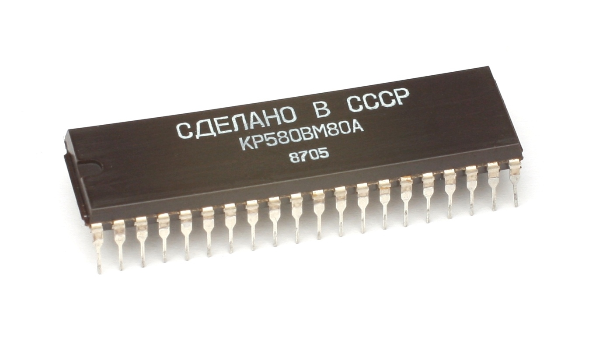
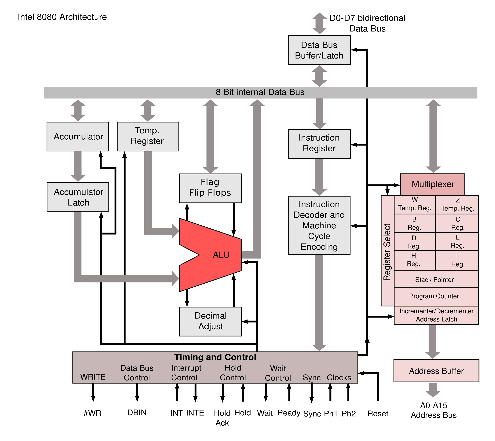

# Introduction

The KR580VM80A (Russian: КР580ВМ80А) is a Soviet microprocessor, a clone of the Intel 8080 CPU.

The Intel 8080 is the successor to the 8008. It uses the same basic instruction set and register model as the 8008, although it is neither source code compatible nor binary code compatible with its predecessor. Every instruction in the 8008 has an equivalent instruction in the 8080. The 8080 also adds 16-bit operations in its instruction set. Whereas the 8008 required the use of the HL register pair to indirectly access its 14-bit memory space, the 8080 added addressing modes to allow direct access to its full 16-bit memory space. The internal 7-level push-down call stack of the 8008 was replaced by a dedicated 16-bit stack-pointer (SP) register. The 8080's 40-pin DIP packaging permits it to provide a 16-bit address bus and an 8-bit data bus, enabling access to 64 KiB (216 bytes) of memory.

