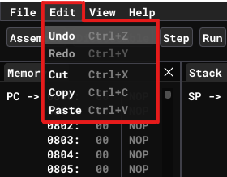

# Menu bar

Menu bar is located at the very top of the program as shown at picture below:

It contains 4 items:
* [File](#file)
* [Edit](#edit)
* [View](#view)
* [Help](#help)

## File 

Here user can reset emulator by clicking on `New` button, or open previously saved data from file by clicking on `Open` button.

Emulator supports saving in two differend formats. Firstly it can save source code from [Editor](user-interface.md#editor) by clicking `Save as *.asm`. It saves assembler mnemonics as .asm file on your file system. Secondly in can save machine code (memory dump) from [Memory](user-interface.md#memory) by clicking `Save as *.obj`. This approach saves raw bytes from memory to .obj file on your file system.

You can load both of this file formats identically when opening files as described above. For more details see [Saving and Loading](saving-and-loading.md).

Also you can exit from the emulator by clicking at `Exit` button at the very bottom.

## Edit

Emulator supports all common editing features as well as hot-keys for them. All of them are illustrated at the picture above.

## View

In the emulator you can close any of the windows to create your own custom layout that you are comfortable to work with. To close the window click at the 'X' button at top-right corner of the window. To open any window back you use this menu bar item.

## Help

me
