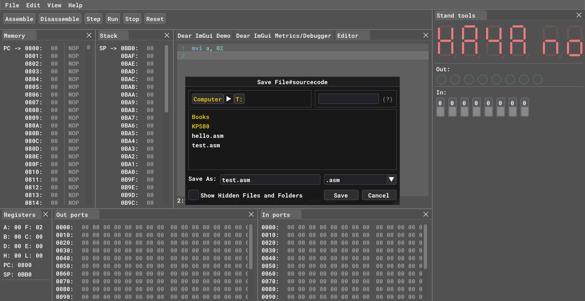

# Saving and Loading

## Saving

;

You can save data in two different ways:
1. Save source code
2. Save machine code

By clicking `Save as *.asm` you can save **source** code from [Editor](user-interface.md#editor) window as .asm file. When you click `Save as *.asm` window shown below will pop up.

In this pop-up window you can choose file location and file name to save it in your file system.

---

By clicking `Save as *.obj` you can save **machine** code from [Memory](user-interface.md#memory). This approach saves raw bytes from memory to .obj file on your file system. Same window as above will pop-up to let you choose location and file name.

## Loading
You can load saved data by clicking `Open` button. When loading emulator will figure out what file format you are trying to open and load that file either as source code or machine code.

Same window will pop-up for you to choose file from your file system.
