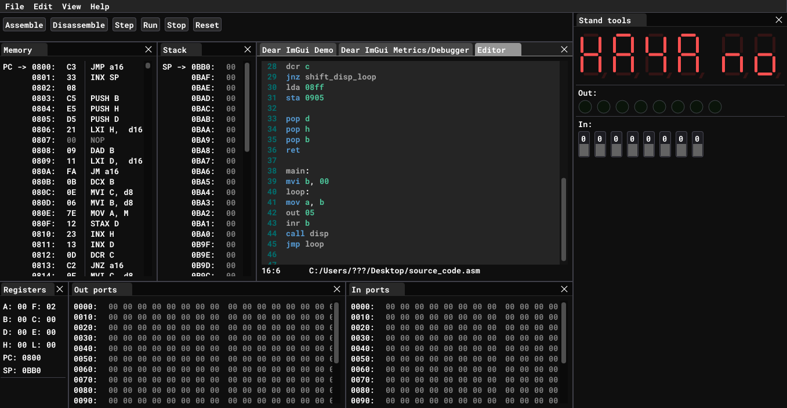

# Emulator

A fast & simple KR580 (i8080 clone) CPU emulator.

This whole emulator is based on UMPK-80. UMPK-80 is an educational hardware for understanding of cpu workflow. UMPK-80 has two types of memory: RAM and ROM. More information shown in the table below.

|Address|Type|Description|
|-------|----|-----------|
|0x0000-0x07FF| ROM | "Monitor" program and system procedures|
|0x0800-0x0B80| RAM | User memeory|
|0x0B80-0x0BB0| RAM | Stack|
|0x0BB1-0x0BFF| RAM | System RAM used my "Monitor" program|
|0x0C00-0x0FFF| RAM | User memory and system extensions|

"Monitor" is a program which is used as simple operating system. This program lets hardware implement interaction with a user. "Monitor" program is located in ROM. 

RAM is splited into several sections. Fully "free" for writing user programs are user memory section _0x0800-0x0B80_ and _0x0C00-0x0FFF_. Access to other sections is not recommended.  

Emulator has following user interface:

## User interface
It has eight differens windows:
* [Toolbar](user-interface.md#toolbar)
* [Memory](user-interface.md#memory)
* [Stack](user-interface.md#stack)
* [Editor](user-interface.md#editor)
* [Stand tools](user-interface.md#stand-tools)
* [Registers](user-interface.md#registers)
* [In ports](user-interface.md#in-ports)
* [Out ports](user-interface.md#out-ports)
