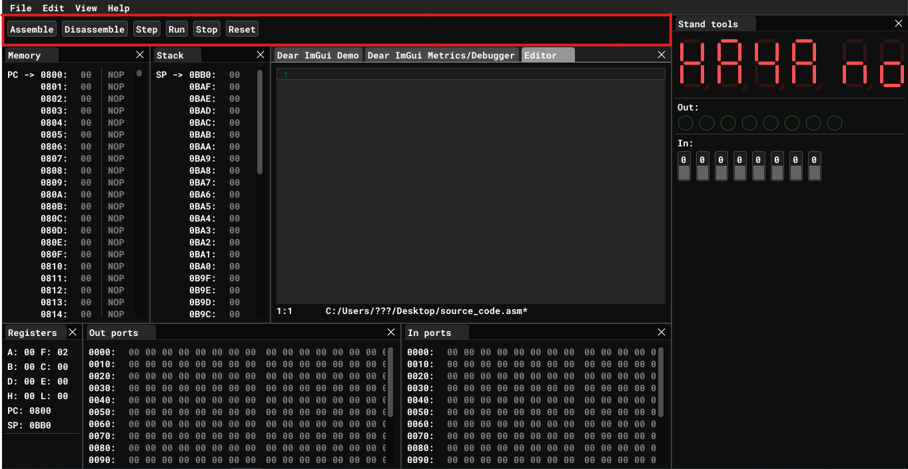
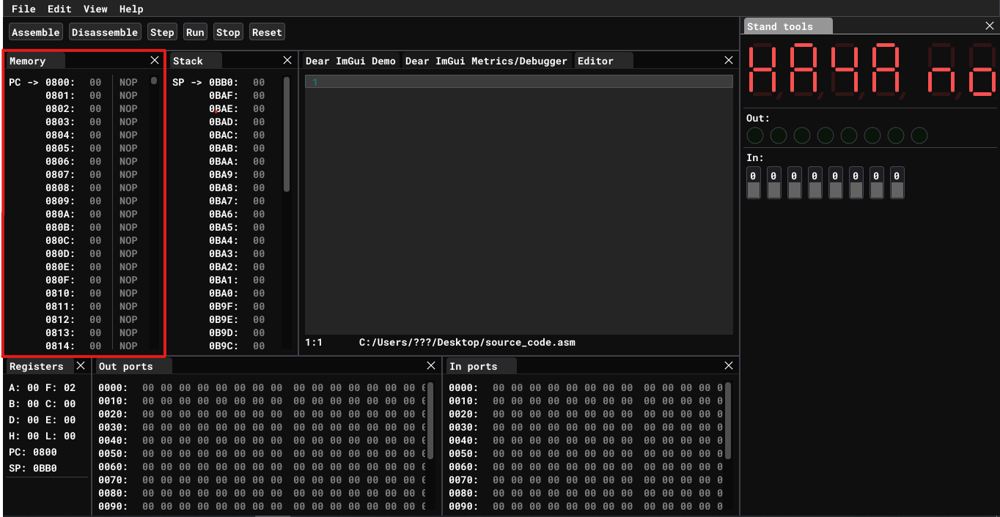
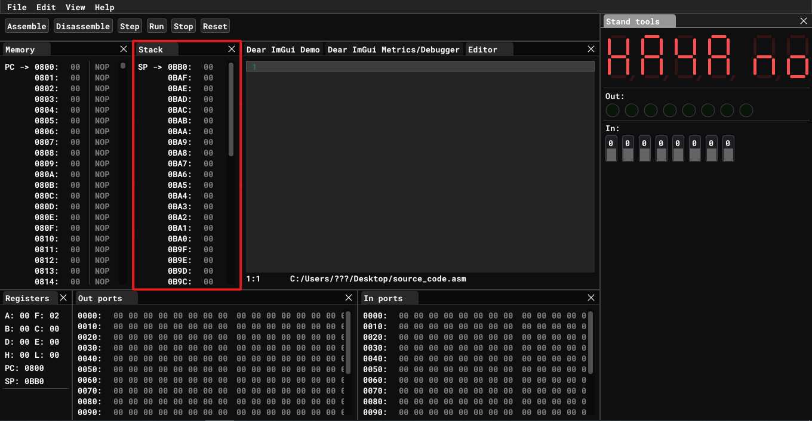
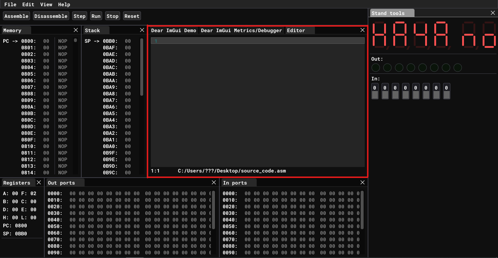
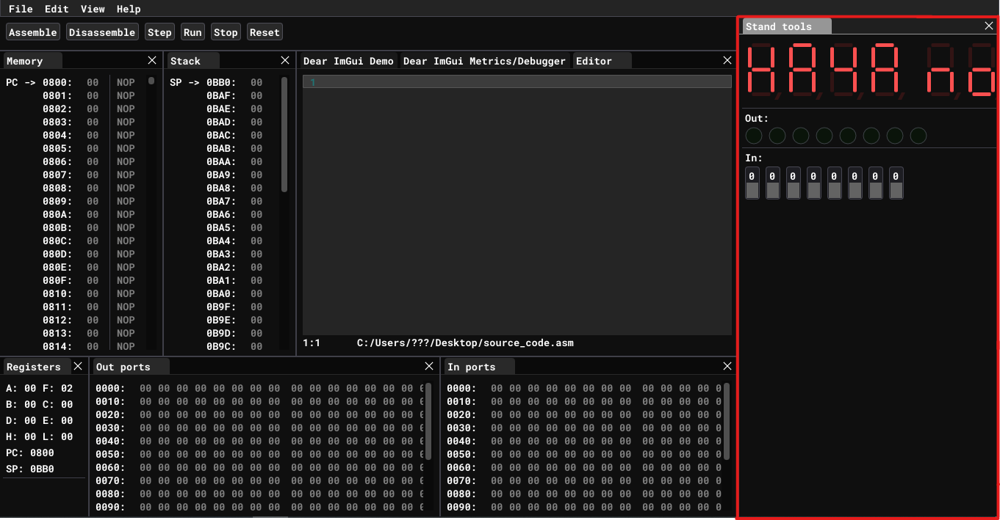
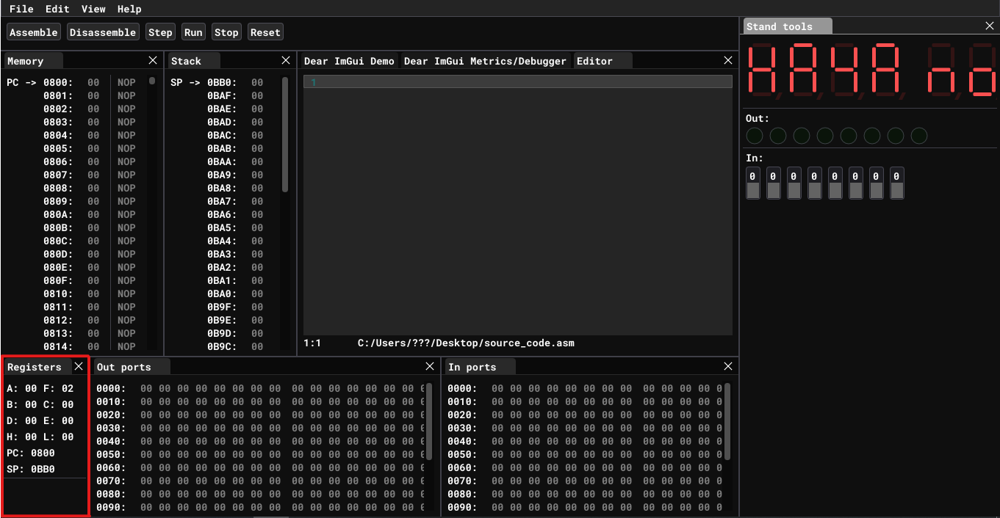

# User Interface

## Toolbar

Tool bar has key buttons to interact with emulator. To assemble source code from [Editor](./user-interface.md#editor) window into machine code click `Assemble` button. You can see assembled code in [Memory](./user-interface.md#memory) window. To translate machine code from [Memory](./user-interface.md#memory) to source code click `Disassemble` button. Disassembled mnemonics will appear in [Editor](./user-interface.md#editor) window. 

Emulator support execution of the program step by step. To execute instruction pointed by [program counter](https://en.wikipedia.org/wiki/Program_counter) click `Step` button. It will execute the instruction and increment program counter automatically.

To execute whole program click `Run` button. It will execute instruction one by one until it reaches _RST1_ instruction.

To prematurely stop execution of running program click `Stop` button.

To reset [PC](https://en.wikipedia.org/wiki/Program_counter) and [SP](https://en.wikipedia.org/wiki/Stack_register) to its initial values click `Reset` button. In this particular case PC will be initialized to 0x0800 and SP will be initialized to 0x0BB0. 

## Memory

This window contains bytes of memory space from 0x0800 to 0x0B8F. This windos shows only user memory range. In `UMPK 80` user memory space starts from 0x0800 and ends at 0x0B8F.

Also on the right side of memory window corresponding assembler mnemonics are shown for you to easy match it with source code. If specific byte is not a valid instruction mnemonic is not shown.

## Stack

Stack is a stack data structure that stores information about the active subroutines of a computer program. This kind of stack is also known as an execution stack, program stack, control stack, run-time stack, or machine stack, and is often shortened to just "the stack". 

To push data onto the stack use `PUSH RR` instruction. That instruction will push RR register pair to address pointer by SP and decrement SP by two automatically. To pop data from the stack use `POP RR` instruction. That instruction will increment SP by two and put data from top of the stack to RR register pair. For more information see [PUSH](./ISA.md#push) and [POP](./ISA.md#pop)

In UMPK 80 stack memory range starts at 0x0BB0 and ends at 0x0B80. This memory range is shown in this window. **Notice that stack grows downwards!**

## Editor

This window is simple text editor for source code in assembler language. It supports highlighting of keywords and built in registers. This code is gonna be assembled when clicking `Assemble` button from [Toolbar] described above.

## Stand tools

This window represents _UMPK 80_ built in tools like display, value of _OUT 5_ port and input for _IN 5_ port.

## Registers

The processor has seven 8-bit registers (A, B, C, D, E, H, and L), where A is the primary 8-bit accumulator. The other six registers can be used as either individual 8-bit registers or in three 16-bit register pairs (BC, DE, and HL, referred to as B, D and H in Intel documents) depending on the particular instruction. Some instructions also enable the HL register pair to be used as a (limited) 16-bit accumulator. A pseudo-register M, which refers to the dereferenced memory location pointed to by HL, can be used almost anywhere other registers can be used. 

The processor maintains internal flag bits (a status register), which indicate the results of arithmetic and logical instructions. Only certain instructions affect the flags. 

|Flags:|
|----|
|Sign (S), set if the result is negative.
Zero (Z), set if the result is zero.
Parity (P), set if the number of 1 bits in the result is even.
Carry (C), set if the last addition operation resulted in a carry or if the last subtraction operation required a borrow
Auxiliary carry (AC or H), used for binary-coded decimal arithmetic (BCD).
The carry bit can be set or complemented by specific instructions. Conditional-branch instructions test the various flag status bits. The flags can be copied as a group to the accumulator. The A accumulator and the flags together are called the PSW register, or program status word.

## Ports

The 8080 supports up to 256[16] input/output (I/O) ports, accessed via dedicated I/O instructions taking port addresses as operands. This I/O mapping scheme is regarded as an advantage, as it frees up the processor's limited address space. Many CPU architectures instead use so-called memory-mapped I/O (MMIO), in which a common address space is used for both RAM and peripheral chips. This removes the need for dedicated I/O instructions, although a drawback in such designs may be that special hardware must be used to insert wait states, as peripherals are often slower than memory. However, in some simple 8080 computers, I/O is indeed addressed as if they were memory cells, "memory-mapped", leaving the I/O commands unused. I/O addressing can also sometimes employ the fact that the processor outputs the same 8-bit port address to both the lower and the higher address byte (i.e., IN 05h would put the address 0505h on the 16-bit address bus).
